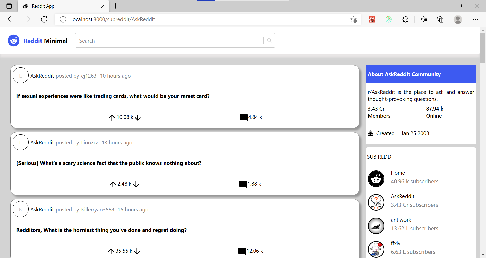

# Reddit Client App

## Table of Contents

* [Description](#description)
* [Technologies](#technologies)
  * [Languages](#lechnologies)
  * [Framework / Libraries](#Framework-/-Libraries)
  * [Deploy Technology](#deploy-technology)
  * [Other Technologies](#other-technologies)
* [Setup Process](#setup-process)
* [Acknowledgments](#acknowledgements)

## Description

A front-end web app displaying data fetched from Reddit API. The web app is designed using React and Redux.

## Technologies

### Languages

* Javascript
* JSX
* HTML
* CSS

### Framework / Libraries

* React
* Redux
* Material UI

### Deploy Technology

* netlify

### Other Technologies

* VSCode
* Git
* GitHub

## Setup Process

* Clone or download the repository
* Open the directory on the terminal and run the development by typing 'npm run' (make sure to npm install everything)

## Acknowledgements

This project obtains the data from Reddit API. I have nothing to do with the content displayed in the web app. This is a Codecademy project for Full-Stack Software Engineering Course.The goal was to practice and implement the front-end skills gained during the course (HTML, CSS, JavaScript, React, Redux, Jest, Enzyme, Git and Github Projects, Command line, Wireframes).